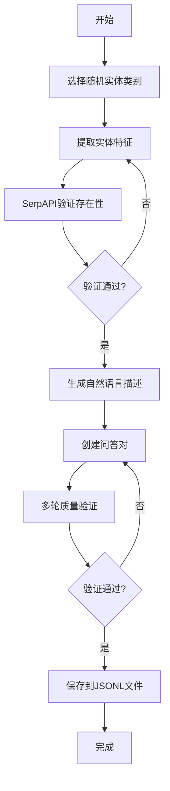
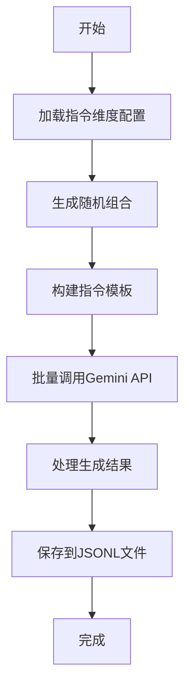
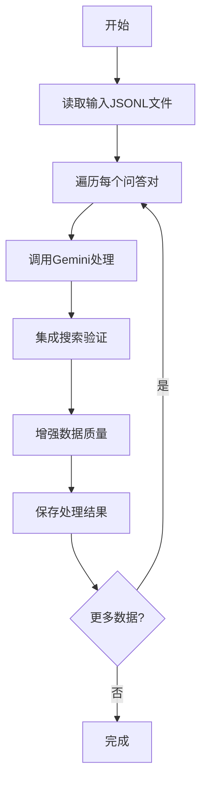
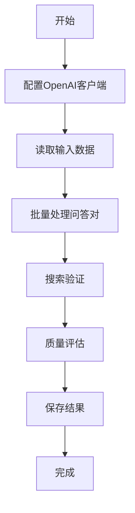
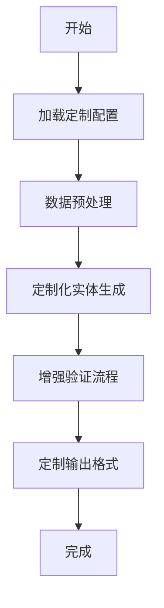
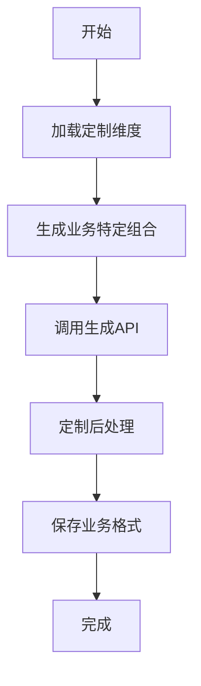

# 合成数据生成客户端

本客户端提供多种合成数据生成工具，用于创建高质量的问答对和实体数据。

## 📁 项目结构

```
client/
├── prompt.py                 # 统一的提示词模板
├── basicqa_generator.py      # 基础问答生成器
├── basicqa_generator_huichi.py  # 辉池写的基础问答生成器
├── browsercamp_gemini.py     # Gemini生成browsercamp
├── browsercamp_oai.py        # OpenAI生成browsercamp
├── entity_generator.py       # 实体生成器
├── entity_generator_huichi.py  # 辉池写的实体生成器
└── utils/                    # 工具模块
```

## 🛠️ 工具详细说明

### 1. basicqa_generator.py - 基础问答生成器

**目的**: 生成冷门实体的问答对，通过特征提取和验证确保数据质量

**输入**:
- 预定义的实体类别（prompt.py中的ENTITY_CATEGORIES）
- OpenAI API密钥
- SerpAPI密钥用于实体验证

**输出**:
- JSONL格式的问答对文件（result/entity_questions_generator_result.jsonl）
- 每个条目包含实体、问题、答案和验证信息

**处理流程**:
1. 从预定义类别中随机选择实体
2. 提取实体特征并进行唯一性检查
3. 使用SerpAPI验证实体存在性
4. 生成自然语言描述和问题
5. 多轮验证确保数据质量

**Mermaid流程图**:


### 2. entity_generator.py - 实体生成器

**目的**: 使用多维指令模板批量生成多样化合成实体数据

**输入**:
- 预定义的指令维度（学科、方法论、地理范围等）
- Gemini API配置
- 生成样本数量配置

**输出**:
- JSONL格式的生成实体（result/generated_entities.jsonl）
- 每个条目包含指令模板和Gemini响应

**处理流程**:
1. 从多个维度生成随机组合
2. 构建完整的指令模板
3. 使用Gemini API批量生成内容
4. 保存结果到JSONL文件

**Mermaid流程图**:


### 3. browsercamp_gemini.py - Gemini浏览器竞赛生成

**目的**: 使用Gemini处理问答数据，集成搜索功能增强数据真实性

**输入**:
- 输入数据文件（JSONL格式）
- Gemini API配置
- 输出目录配置

**输出**:
- 处理后的问答数据文件
- 包含增强的搜索信息和验证结果

**处理流程**:
1. 读取输入JSONL数据
2. 使用Gemini处理每个问答对
3. 集成搜索功能验证信息
4. 保存增强后的数据

**Mermaid流程图**:


### 4. browsercamp_oai.py - OpenAI浏览器竞赛生成

**目的**: 使用OpenAI处理特定领域问答数据，集成搜索功能

**输入**:
- 输入数据文件（JSONL格式）
- OpenAI API配置
- 输出目录配置

**输出**:
- 处理后的问答数据文件
- 包含搜索增强的验证信息

**处理流程**:
1. 读取输入数据文件
2. 使用OpenAI API处理每个条目
3. 集成搜索工具进行验证
4. 保存最终结果

**Mermaid流程图**:


### 5. basicqa_generator_huichi.py - 辉池基础问答生成器

**目的**: 辉池定制版本的基础问答生成器，针对特定需求优化

**特性**:
- 基于basicqa_generator.py的定制版本
- 针对特定数据格式和处理流程优化
- 增强的错误处理和重试机制

**处理流程**:


### 6. entity_generator_huichi.py - 辉池实体生成器

**目的**: 辉池定制版本的实体生成器，支持特定业务需求

**特性**:
- 基于entity_generator.py的定制版本
- 特定的指令维度配置
- 定制化的输出格式和处理逻辑

**处理流程**:


## ⚙️ 配置说明

### 数据源配置
- 实体JSONL数据源文件路径
- 格式要求：每行包含 `{"entity": "实体名称"}`

### 搜索配置
- 每个实体搜索的结果数量
- 页面抓取超时时间（秒）
- 页面内容最大字符数

### 质量控制
- 每个实体尝试的最大页面数
- 每个QA对的验证尝试次数
- 只有所有验证尝试都失败的QA才会被保留

## 🎯 功能特性

### basicqa_generator.py
- ✅ 基于实体生成困难问答对
- ✅ 多轮LLM验证确保质量
- ✅ 支持MCP工具集成（搜索+抓取）
- ✅ 自动过滤简单问题

### entity_generator.py
- ✅ 从网页内容抽取冷门实体
- ✅ 支持中英文多语言
- ✅ 维基百科实体过滤
- ✅ 批量处理高效抽取

### browsercamp_*.py
- ✅ 支持OpenAI和Gemini双引擎
- ✅ 自动提取关键字段（问题、答案、数据源）
- ✅ 集成搜索工具增强数据真实性
- ✅ 批量处理JSONL格式数据

## 📊 输出格式

### 合成QA对格式
```json
{
  "entity": "实体名称",
  "question": "生成的问题",
  "ground_truth": "正确答案",
  "evidence_quote": "证据文本",
  "data_source": "数据源URL",
  "page_title": "页面标题",
  "vetting": {
    "model": "gpt-4o",
    "attempts": 8,
    "criterion": "all attempts must fail to keep"
  }
}
```

### 实体抽取格式
```json
{
  "entity": "实体名称",
  "why_uncommon": "不常见原因",
  "source_url": "来源URL",
  "source_title": "来源标题",
  "topic": "主题"
}
```

## 🔧 自定义配置

所有工具都支持通过以下方式配置：

1. **环境变量**: 优先读取 `.env` 文件中的配置
2. **代码修改**: 直接修改文件顶部的配置常量
3. **命令行参数**: entity_generator.py支持完整的命令行参数

## 📝 使用建议

1. **数据质量**: 建议使用高质量实体数据源
2. **API配额**: 注意OpenAI和Gemini的API调用限制
3. **验证机制**: 充分利用多轮验证确保数据难度
4. **批量处理**: 支持批量处理，适合大规模数据生成

## 🐛 故障排除

### 常见问题
1. **API密钥错误**: 检查环境变量设置
2. **文件路径错误**: 确保输入文件存在且有读取权限
3. **网络超时**: 调整超时时间或重试机制
4. **JSON解析错误**: 检查数据格式是否符合JSONL标准